# scHolography: a workflow for single-cell 3D spatial reconstruction <a href='https://github.com/YiLab-SC/scHolography'></a>


scHolography is an neural network-based computational toolkit for integrative scRNA-seq and ST data analysis. Our pipeline enables 3D spatial inference at a high resolution. Instead of mapping cells to a spot on the fixed ST slice, our reconstruction result is orientation-free, and the inferred structure will be varied for different scRNA-seq data inputs. Together with our downstream analytical functions, we aim to bring new perspectives on scRNA-seq and ST data for researchers.

## 0. Installation
### Dependencies

The deep learning functionalities of our package powers by the Keras API. 
To install Keras:
```r
if (!requireNamespace("remotes", quietly = TRUE)) {
  install.packages("remotes")
}
remotes::install_github(sprintf("rstudio/%s", c("reticulate", "tensorflow", "keras")))
reticulate::miniconda_uninstall() 
reticulate::install_miniconda()
tensorflow::install_tensorflow(method = 'conda',envname = 'r-tensorflow',version = '2.12',conda_python_version = '3.9')

######### After above steps, for Mac Apple silicon users, you need to install tensorflow-macos instead of tensorflow by first activating the conda environment and then installing tensorflow-macos in your terminal
## conda activate /Users/YOURPATH/Library/r-miniconda/envs/r-tensorflow
## python -m pip install tensorflow-macos==2.12.0
######### Then you can set the RETICULATE_PYTHON to the python in the conda environment in your R/RStudio
## Sys.setenv(RETICULATE_PYTHON = "/Users/YOURPATH/Library/r-miniconda/envs/r-tensorflow/bin/python")

reticulate::use_condaenv('r-tensorflow')
```

To confirm if the installation is successful:
```r
library(tensorflow)
tf$constant("Hello Tensorflow!")
```

Successful installation will give the output:
```
tf.Tensor(b'Hello Tensorflow!', shape=(), dtype=string)
```

**DO NOT PROCEED TO THE NEXT STEP IF KERAS INSTALLATION FAILS**. For any Keras installation issues, please refer to the Keras page: https://github.com/rstudio/keras 


The default integration and SC and ST objects are based on Seurat V4. To install compatible Seurat V4:
```r
options(repos = c("https://satijalab.r-universe.dev", getOption("repos")))
remotes::install_version("SeuratObject", "4.1.3")
remotes::install_version("Seurat", "4.3.0", upgrade = FALSE) 
```

### Install scHolography

```r
remotes::install_github("YiLab-SC/scHolography", upgrade = FALSE)
```
Load scHolography for use:
```r
library(scHolography)
```

## 1. scHolography 3D Reconstruction

For demonstration, we are using our in-house human skin mouse brain data. The pocessed Seurat objects can be downloaded from:

The human skin scRNA-seq data: https://drive.google.com/file/d/1J-TKEcv5Lmom19mSSFLfgnI9JnBtW_Au/view?usp=sharing

The human skin ST 10X Visium data: https://drive.google.com/file/d/1aF0zv5uEHu-42BJQWXtkLy7qrf9ELfq9/view?usp=sharing

Load packages:
```r
library(scHolography)
library(Seurat)
library(ggplot2)
library(dplyr)
library(RColorBrewer)
library(viridis)
```

Load data into our workspace:
```r
low.res.sp<-readRDS("~/Downloads//low.res.human.sk.rds")
high.res.sp<-readRDS("~/Downloads//high.res.human.sk.rds")
```
```r
Seurat::DimPlot(high.res.sp,group.by = "celltype",cols = c("#A6CEE3","#79C360", "#3F8EAA",  "#B89B74", "#E52829", "#FDB762", "#ED8F47", "#9471B4" ,"#DDD399" ,"#B15928"))+ggplot2::ggtitle("")
```
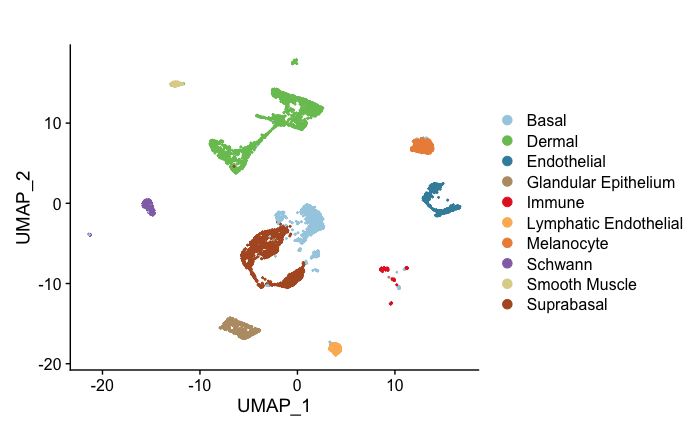

scHolography can take in objects directly after quality control and automatically perform normalization before integration. `dataAlign` integrations expression data from scRNA-seq and ST modalities. `trainHolography` trains neural network models and infers a SMN graph.
```r
sp.integrated <- dataAlign(low.res.sp,high.res.sp,nPCtoUse = 32,scProcessed = T)
scHolography.obj<-trainHolography(sp.integrated,n.slot = 30,n.pcUse = 32,n.pcOut = 32,n.repeat = 30)
```
### Visualization by Celltype

The reconstruction results can be visualized in 3D with `scHolographyPlot`:
```r
### Set the celltype as factor
scHolography.obj$scHolography.sc$celltype<- factor(as.character(scHolography.obj$scHolography.sc$celltype),levels = c("Basal" ,"Endothelial","Dermal",  "Glandular Epithelium","Immune" , "Lymphatic Endothelial" ,"Melanocyte" ,"Schwann" ,"Smooth Muscle"  , "Suprabasal"  ))

### To orient the plot in a more intuitive way
scHolography.obj$scHolography.sc$z3d_sp <- -scHolography.obj$scHolography.sc$z3d_sp
scHolography.obj$scHolography.sc$x3d_sp <- -scHolography.obj$scHolography.sc$x3d_sp
scHolography.obj$scHolography.sc$y3d_sp <- -scHolography.obj$scHolography.sc$y3d_sp
scene = list(camera = list(eye = list(x = -1, z = 0, y = 2)))

### To visualize the 3D structure colored by celltype
scHolographyPlot(scHolography.obj,color.by = "celltype")%>% plotly::layout(scene = scene)
```
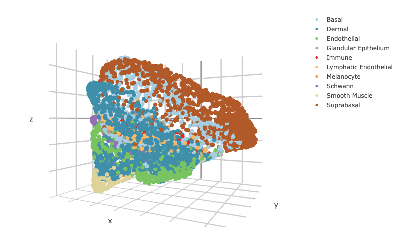

### Visualization by Features

scHolography also assists visualizations of different features on the reconstructed 3D structure. Here, we show three layer neuron marker expression. 
```r
scHolographyPlot(scHolography.obj,feature  = "KRT10")%>% plotly::layout(scene = scene)
```
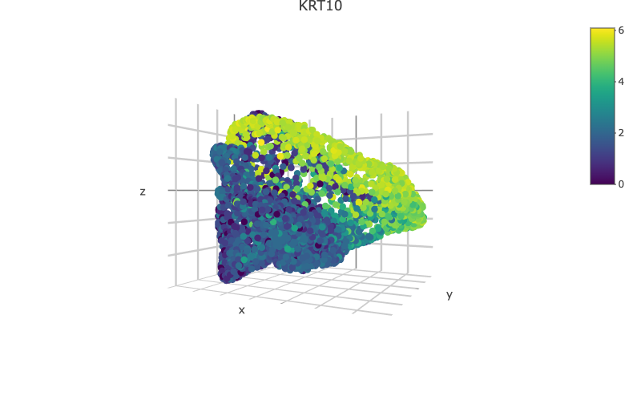
```r
scHolographyPlot(scHolography.obj,feature = "KRT5")%>% plotly::layout(scene = scene)
```
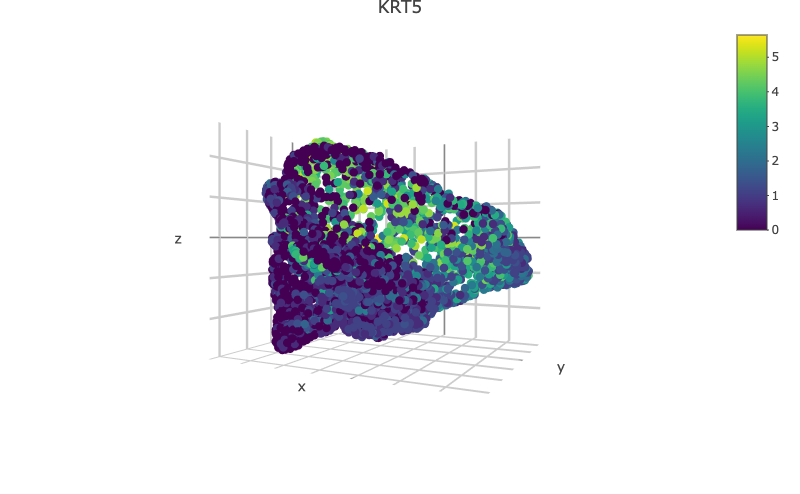
```r
scHolographyPlot(scHolography.obj,feature = "COL1A2")%>% plotly::layout(scene = scene)
```
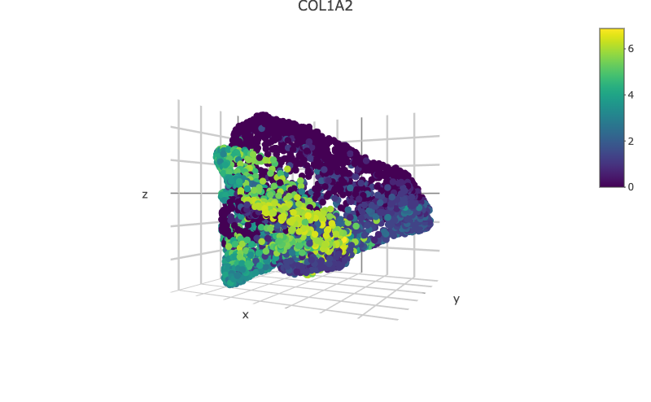
```r
scHolographyPlot(scHolography.obj,feature = "ACTA2")%>% plotly::layout(scene = scene)
```
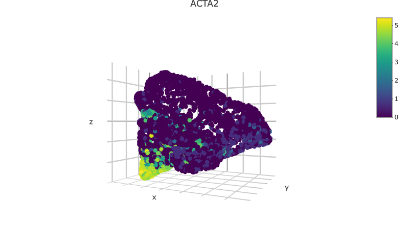

## 2. SMN Distance and First-Degree Neighbors

### clusterDistanceBoxplot
Based on the reconstructed graph, scHolography can investigate spatial relationship among cell clusters of interest by calculating their SMN distances. Here we demonstrate a boxplot for distances between the major skin cells to all smooth muscle cells.

```r
clusterDistanceBoxplot(scHolography.obj,annotationToUse = "celltype",reference.cluster = "Smooth Muscle",query.cluster.list = c("Suprabasal","Basal","Dermal","Smooth Muscle"))
```
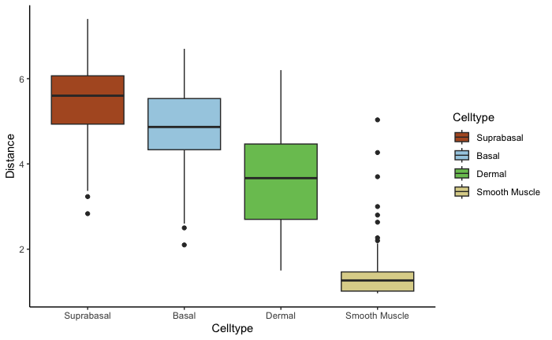

### scHolographyNeighborCompPlot
For each cell cluster, we can further examine its inferred microenvironment by dissecting their first-degree neighbor cell type composition on the SMN graph. scHolography enables this query with `scHolographyNeighborCompPlot`. This function output **1.** first-degree neighbor composition plot of all neighbors; **2.** first-degree neighbor composition plot for only enriched neighboring cell types; **3.** significance levels for each enriched neighboring cell type.

```r
neighbor.comp<- scHolographyNeighborCompPlot(scHolography.obj,annotationToUse = "celltype",query.cluster = c("Suprabasal","Basal","Glandular Epithelium","Dermal","Endothelial","Lymphatic Endothelial","Smooth Muscle", "Schwann","Immune","Melanocyte"))

my.color.order= c("#A6CEE3" ,"#79C360", "#3F8EAA" ,colorRampPalette(brewer.pal(12,"Paired"))(10)[4:10] ) # color order for the plot

neighbor.comp$neighbor.comp.plot+scale_fill_manual(values = my.color.order)
```
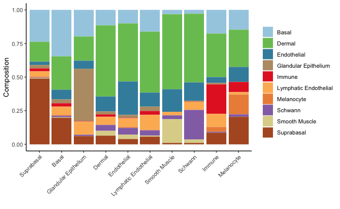

```r
neighbor.comp$neighbor.comp.sig.plot+scale_fill_manual(values = my.color.order)
```
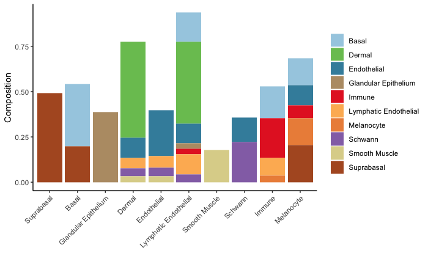

```r
neighbor.comp$significance
```

```
$Suprabasal
Suprabasal 
         0 

$Basal
       Basal   Suprabasal 
0.0000000000 0.0002323026 

$`Glandular Epithelium`
Glandular Epithelium 
                   0 

$Dermal
               Dermal           Endothelial Lymphatic Endothelial               Schwann 
         0.000000e+00          1.252084e-13          1.381670e-28          3.444694e-29 
        Smooth Muscle 
         3.282852e-40 

$Endothelial
          Endothelial Lymphatic Endothelial               Schwann         Smooth Muscle 
         0.000000e+00          3.718200e-02          1.030445e-05          2.715165e-11 

$`Lymphatic Endothelial`
                Basal                Dermal           Endothelial  Glandular Epithelium 
         2.298314e-10          1.070546e-06          1.277586e-11          1.084878e-17 
               Immune Lymphatic Endothelial               Schwann 
         2.852786e-10         8.049785e-148          8.850146e-05 

$`Smooth Muscle`
Smooth Muscle 
3.447845e-194 

$Schwann
  Endothelial       Schwann 
 4.107800e-02 8.314729e-259 

$Immune
                Basal                Immune Lymphatic Endothelial            Melanocyte 
         2.309712e-06         2.654720e-235          8.292197e-06          2.322086e-07 

$Melanocyte
        Basal   Endothelial        Immune    Melanocyte    Suprabasal 
 4.217856e-04  1.134285e-02  4.239131e-26 1.380532e-155  2.910273e-03 

```

## 3. Spatial Neighborhoods

The `findSpatialNeighborhood` function aims to define distinct spatial neighborhoods and study single-cell spatial heterogeneity in a transcriptome-spatial integrated manner. First, the function decides the number of distinct neighborhoods to define from scHolography inferred query cell spatial distribution. The silhouette coefficient optimizes the number of spatial neighborhoods. The accumulated SMN expression profile of SMNs for each query cell is defined as the sum of the scRNA-seq count of all SMNs of the query cell. The accumulated SMN expression matrix is normalized and the spatial neighborhoods are defined using K-means clustering with the optimized cluster number or by setting the `nNeighborhood`. Differentially expressed genes are found for both accumulated SMN and single-cell expressions of each spatial neighborhood. In this example, we investigate the spatial neighborhood of human dermal cells.


```r  
#Find the spatial neighborhood of Dermal cells
spatial.neighbor.Dermal <- findSpatialNeighborhood(scHolography.obj ,annotationToUse = "celltype",query.cluster = c("Dermal"),orig.assay = "RNA",nNeighborhood = 4)

#Rename the spatial neighborhood and Define the color for the plot
spatial.neighbor.Dermal$scHolography.obj$scHolography.sc$spatial.neighborhood[which(spatial.neighbor.Dermal$scHolography.obj$scHolography.sc$spatial.neighborhood%in%c(as.character(1:4)))] <- paste0("Dermal_",spatial.neighbor.Dermal$scHolography.obj$scHolography.sc$spatial.neighborhood[which(spatial.neighbor.Dermal$scHolography.obj$scHolography.sc$spatial.neighborhood%in%c(as.character(1:4)))])
fib.sp.col <-  c(c(colorRampPalette(brewer.pal(12,"Paired"))(10)[1],(brewer.pal(4,"Greens"))),colorRampPalette(brewer.pal(12,"Paired"))(10)[c(2,4:10)])

#Plot the spatial neighborhood
scHolography::scHolographyPlot(spatial.neighbor.Dermal$scHolography.obj,color.by = "spatial.neighborhood",color = fib.sp.col)%>% plotly::layout(scene = scene)
```
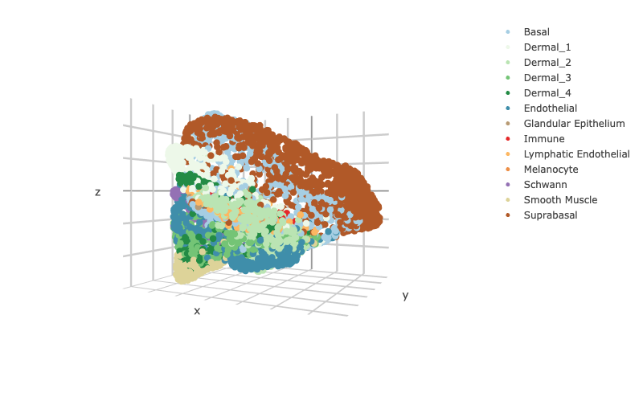

We can  visualize the expression of the top 10 differentially expressed genes for accumulated SMN in each spatial neighborhood of Dermal cells.
```r
spatial.neighbor.Dermal$neighbor.marker %>%
  group_by(cluster) %>%
  top_n(n = 10, wt = avg_log2FC) -> top10
Seurat::DoHeatmap(spatial.neighbor.Dermal$bulk.count.obj,assay = "SCT", features = top10$gene,group.colors = brewer.pal(4,"Greens")) + NoLegend()+scale_fill_viridis()+theme(axis.text = element_text(size = 16,face = "bold"))
```
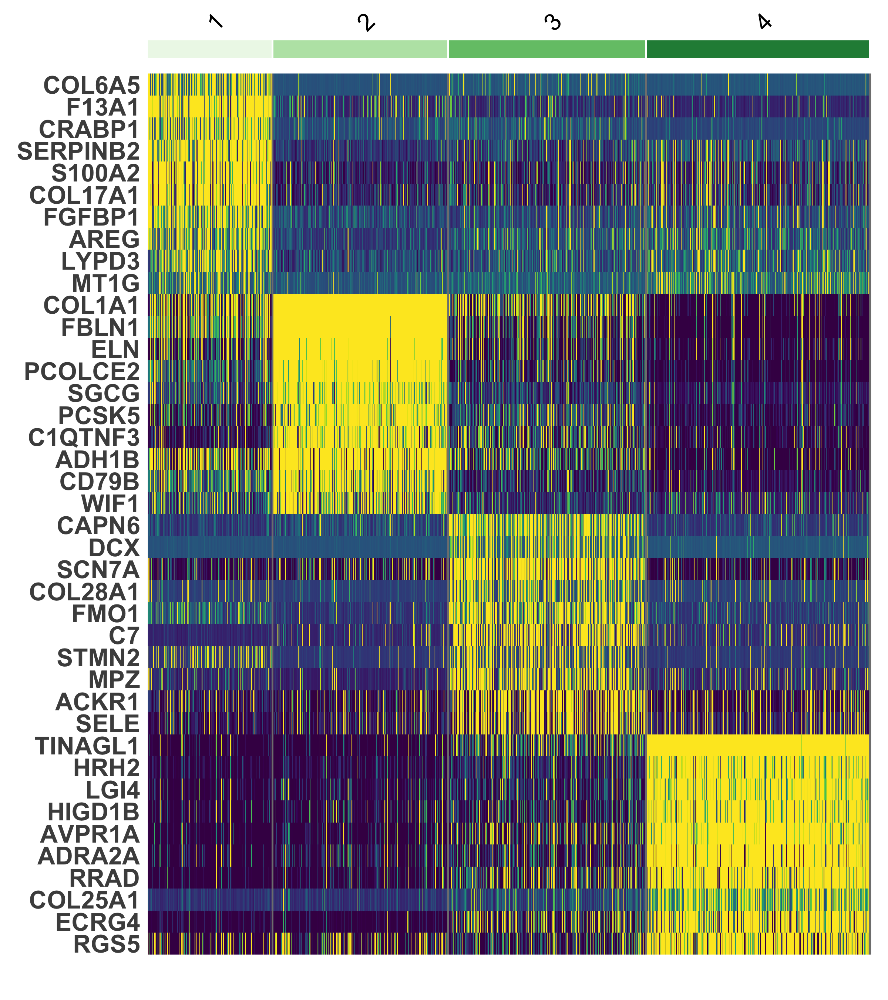


## 4. Session Information

```r
sessionInfo()
```
```
R version 4.2.1 (2022-06-23)
Platform: aarch64-apple-darwin20 (64-bit)
Running under: macOS 14.4.1

Matrix products: default
LAPACK: /Library/Frameworks/R.framework/Versions/4.2-arm64/Resources/lib/libRlapack.dylib

locale:
[1] en_US.UTF-8/en_US.UTF-8/en_US.UTF-8/C/en_US.UTF-8/en_US.UTF-8

attached base packages:
[1] stats     graphics  grDevices utils     datasets  methods   base     

other attached packages:
[1] RColorBrewer_1.1-3 dplyr_1.1.2        ggplot2_3.4.2      SeuratObject_4.1.3 Seurat_4.3.0      
[6] scHolography_0.1.0

loaded via a namespace (and not attached):
  [1] Rtsne_0.16             colorspace_2.1-0       deldir_1.0-6           ellipsis_0.3.2        
  [5] ggridges_0.5.4         base64enc_0.1-3        rstudioapi_0.14        spatstat.data_3.0-1   
  [9] farver_2.1.1           leiden_0.4.3           listenv_0.9.0          matchingR_1.3.3       
 [13] ggrepel_0.9.3          fansi_1.0.4            codetools_0.2-19       splines_4.2.1         
 [17] knitr_1.42             polyclip_1.10-4        zeallot_0.1.0          jsonlite_1.8.4        
 [21] ica_1.0-3              cluster_2.1.4          png_0.1-8              tfruns_1.5.1          
 [25] uwot_0.1.14            shiny_1.7.4            sctransform_0.3.5      spatstat.sparse_3.0-1 
 [29] compiler_4.2.1         httr_1.4.5             Matrix_1.5-4           fastmap_1.1.1         
 [33] lazyeval_0.2.2         limma_3.52.4           cli_3.6.1              later_1.3.1           
 [37] htmltools_0.5.5        tools_4.2.1            igraph_1.4.2           gtable_0.3.3          
 [41] glue_1.6.2             RANN_2.6.1             reshape2_1.4.4         gmodels_2.18.1.1      
 [45] Rcpp_1.0.10            scattermore_0.8        vctrs_0.6.2            gdata_2.18.0.1        
 [49] spatstat.explore_3.1-0 nlme_3.1-162           progressr_0.13.0       crosstalk_1.2.0       
 [53] lmtest_0.9-40          spatstat.random_3.1-4  xfun_0.39              stringr_1.5.0         
 [57] globals_0.16.2         mime_0.12              miniUI_0.1.1.1         lifecycle_1.0.3       
 [61] irlba_2.3.5.1          gtools_3.9.4           goftest_1.2-3          future_1.32.0         
 [65] MASS_7.3-59            zoo_1.8-12             scales_1.2.1           promises_1.2.0.1      
 [69] spatstat.utils_3.0-2   parallel_4.2.1         yaml_2.3.7             reticulate_1.28-9000  
 [73] pbapply_1.7-0          gridExtra_2.3          keras_2.11.1           stringi_1.7.12        
 [77] tensorflow_2.11.0.9000 rlang_1.1.1            pkgconfig_2.0.3        matrixStats_0.63.0    
 [81] evaluate_0.20          pracma_2.4.2           lattice_0.21-8         ROCR_1.0-11           
 [85] purrr_1.0.1            tensor_1.5             labeling_0.4.2         patchwork_1.1.2       
 [89] htmlwidgets_1.6.2      cowplot_1.1.1          tidyselect_1.2.0       parallelly_1.35.0     
 [93] RcppAnnoy_0.0.20       plyr_1.8.8             magrittr_2.0.3         R6_2.5.1              
 [97] generics_0.1.3         DBI_1.1.3              withr_2.5.0            pillar_1.9.0          
[101] whisker_0.4.1          fitdistrplus_1.1-11    survival_3.5-5         abind_1.4-5           
[105] sp_1.6-0               tibble_3.2.1           future.apply_1.10.0    KernSmooth_2.23-20    
[109] utf8_1.2.3             spatstat.geom_3.1-0    plotly_4.10.1          rmarkdown_2.21        
[113] viridis_0.6.3          grid_4.2.1             data.table_1.14.8      digest_0.6.31         
[117] xtable_1.8-4           tidyr_1.3.0            httpuv_1.6.9           munsell_0.5.0         
[121] viridisLite_0.4.2   
```


