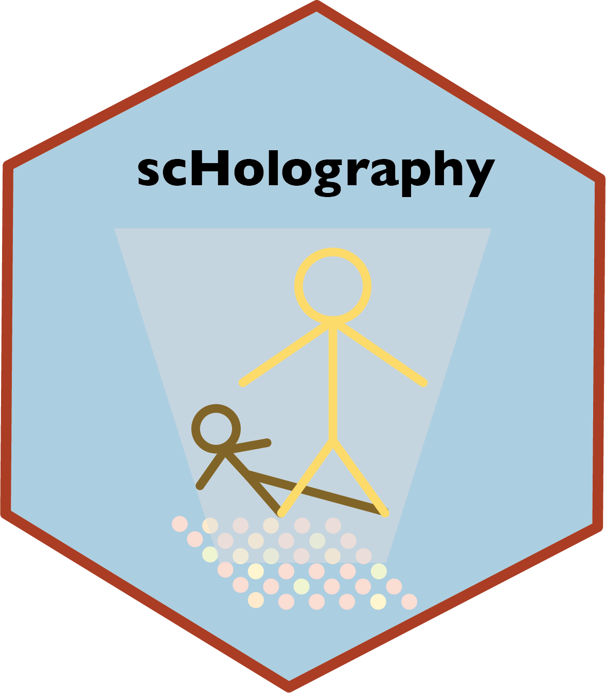

# scHolography: a workflow for single-cell 3D spatial reconstruction <a href='https://github.com/YiLab-SC/scHolography'></a>


scHolography is an neural network-based computational toolkit for integrative scRNA-seq and ST data analysis. Our pipeline enables 3D spatial inference at a high resolution. Instead of mapping cells to a spot on the fixed ST slice, our reconstruction result is orientation-free, and the inferred structure will be varied for different scRNA-seq data inputs. Together with our downstream analytical functions, we aim to bring new perspectives on their scRNA-seq and ST data for researchers.

## 0. Installation
### Dependencies

The deep learning functionalities of our package powers by the Keras package. 
To install Keras:
```r
install.packages("remotes")
remotes::install_github(sprintf("rstudio/%s", c("reticulate", "tensorflow", "keras")))
reticulate::miniconda_uninstall() 
reticulate::install_miniconda()
keras::install_keras()
```

To confirm if the installation is successful:
```r
library(tensorflow)
tf$constant("Hello Tensorflow!")
```

Successful installation will give the output:
```
tf.Tensor(b'Hello Tensorflow!', shape=(), dtype=string)
```

DO NOT PROCEED TO THE NEXT STEP IF THE KERAS INSTALLATION FAILS. Please refer to the Keras page for FAQ: https://github.com/rstudio/keras 


### Install scHolography

```r
install.packages("devtools")
devtools::install_github("YiLab-SC/scHolography")
```
Load the package
```r
library("scHolography")
```

## Step 1: Ti
