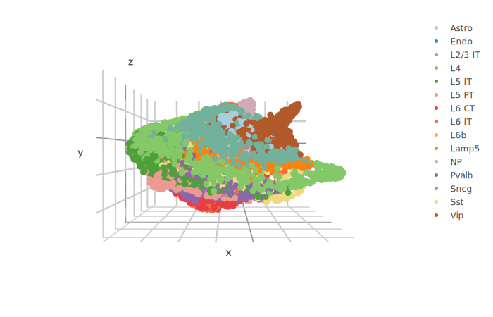
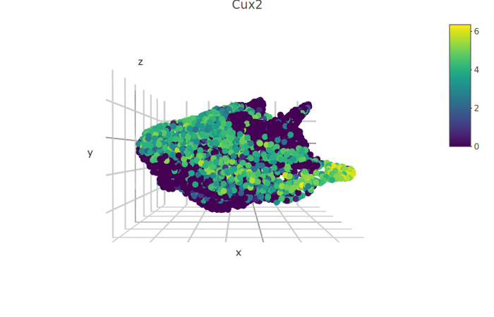
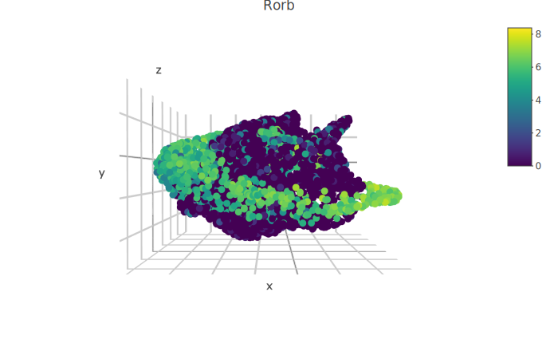
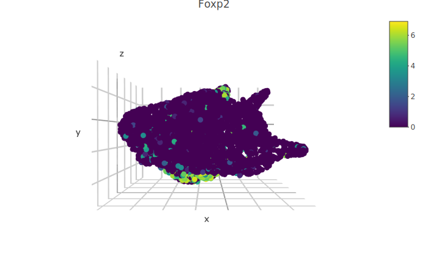
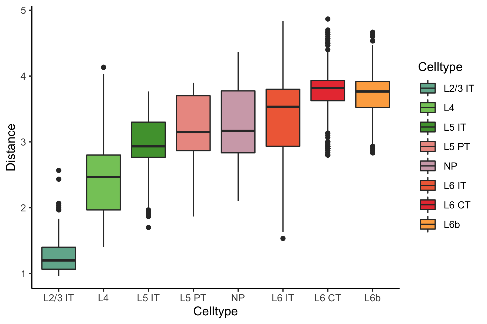
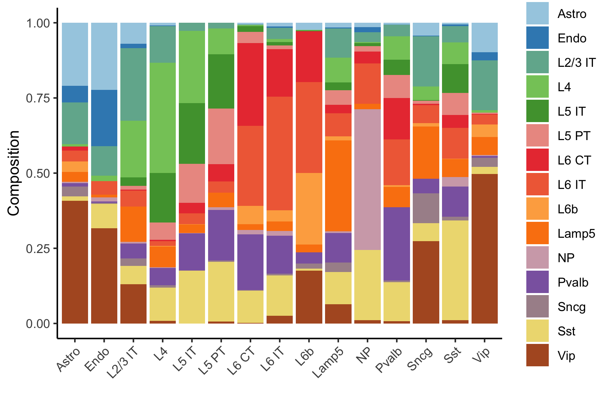
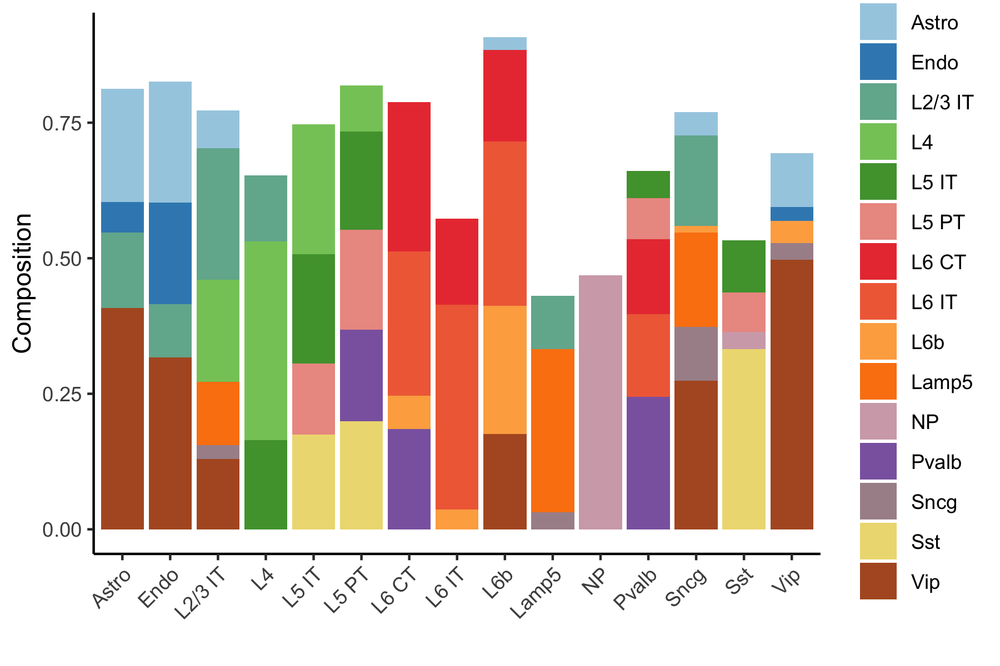
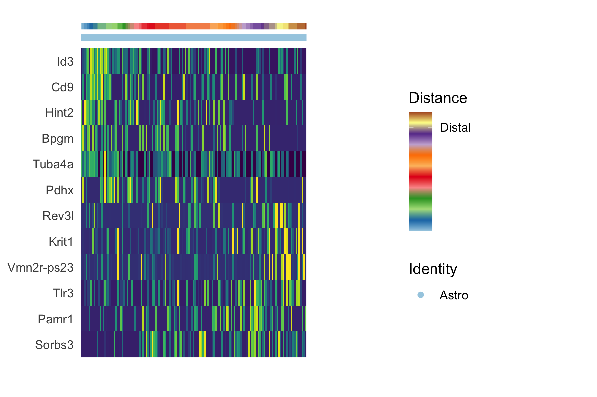
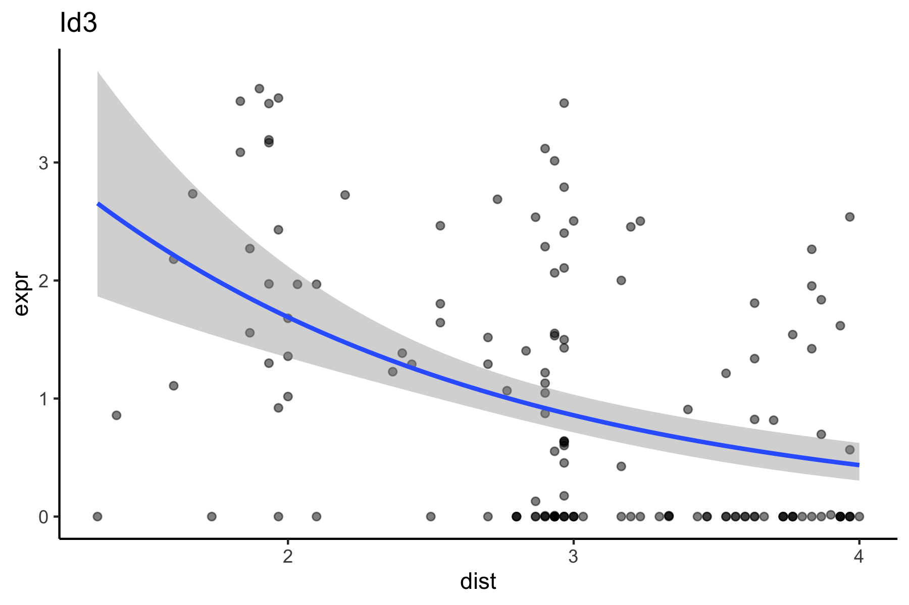

# scHolography: a workflow for single-cell 3D spatial reconstruction <a href='https://github.com/YiLab-SC/scHolography'></a>


scHolography is an neural network-based computational toolkit for integrative scRNA-seq and ST data analysis. Our pipeline enables 3D spatial inference at a high resolution. Instead of mapping cells to a spot on the fixed ST slice, our reconstruction result is orientation-free, and the inferred structure will be varied for different scRNA-seq data inputs. Together with our downstream analytical functions, we aim to bring new perspectives on scRNA-seq and ST data for researchers.

## 0. Installation
### Dependencies

The deep learning functionalities of our package powers by the Keras API. 
To install Keras:
```r
install.packages("remotes")
remotes::install_github(sprintf("rstudio/%s", c("reticulate", "tensorflow", "keras")))
reticulate::miniconda_uninstall() 
reticulate::install_miniconda()
keras::install_keras()
```

To confirm if the installation is successful:
```r
library(tensorflow)
tf$constant("Hello Tensorflow!")
```

Successful installation will give the output:
```
Loaded TensorFlow version 2.10.0
tf.Tensor(b'Hello Tensorflow!', shape=(), dtype=string)
```

**DO NOT PROCEED TO THE NEXT STEP IF KERAS INSTALLATION FAILS**. For any Keras installation issues, please refer to the Keras page: https://github.com/rstudio/keras 


### Install scHolography

```r
install.packages("devtools")
devtools::install_github("talgalili/d3heatmap")            # d3heatmap is a dependent package for scHolography
devtools::install_github("YiLab-SC/scHolography")
```
Load scHolography for use:
```r
library(scHolography)
```

## 1. scHolography 3D Reconstruction

For demonstration, we are using mouse brain data. This dataset has been widely used for ST computational method devlopment and pocessed Seurat objects can be downloaded from CellTrek site:

The mouse brain scRNA-seq data: https://www.dropbox.com/s/ruseq3necn176c7/brain_sc.rds?dl=0

The mouse brain ST data: https://www.dropbox.com/s/azjysbt7lbpmbew/brain_st_cortex.rds?dl=0

Load packages:
```r
library(scHolography)
library(dplyr)
```

Load data into our workspace:
```r
brain_st_cortex <-readRDS("~/Downloads/brain_st_cortex.rds")
brain_sc <- readRDS("~/Downloads/brain_sc.rds")
```

scHolography can take in objects directly after quality control and automatically perform normalization before integration. `dataAlign` integrations expression data from scRNA-seq and ST modalities. `trainHolography` trains neural network models and infers a SMN graph.
```r
options(future.globals.maxSize = 3000 * 1024^2)
sp.integrated <- dataAlign(low.res.sp =  brain_st_cortex,high.res.sp =  brain_sc,nPCtoUse = 32)
brain.obj<-trainHolography(sp.integrated,n.repeat = 30)
```
### Visualization by Celltype

The reconstruction results can be visualized in 3D with `scHolographyPlot`:
```r
scene = list(camera = list(eye = list(x = 0., y = 0.01, z = -2)))
scHolographyPlot(brain.obj,color.by = "cell_type")%>% plotly::layout(scene = scene) 
```


### Visualization by Features

scHolography also assists visualizations of different features on the reconstructed 3D structure. Here, we show three layer neuron marker expression. 
```r
scHolographyPlot(brain.obj,feature = "Cux2")%>% plotly::layout(scene = scene) 
```

```r
scHolographyPlot(brain.obj,feature = "Rorb")%>% plotly::layout(scene = scene) 
```

```r
scHolographyPlot(brain.obj,feature = "Foxp2")%>% plotly::layout(scene = scene) 
```


## 2. SMN Distance and First-Degree Neighbors

### clusterDistanceBoxplot
Based on the reconstructed graph, scHolography can investigate spatial relationship among cell clusters of interest by calculating their SMN distances. Here we demonstrate a boxplot for distances between the L2/3 IT layer to all glutamatergic cells.

```r
clusterDistanceBoxplot(brain.obj,annotationToUse = "cell_type",query.cluster.list = c( "L2/3 IT", "L4","L5 IT","L5 PT","NP", "L6 IT", "L6 CT","L6b" ),reference.cluster="L2/3 IT")
```


### scHolographyNeighborCompPlot
For each cell cluster, we can further examine its inferred microenvironment by dissecting their first-degree neighbor cell type composition on the SMN graph. scHolography enables this query with `scHolographyNeighborCompPlot`. This function output **1.** first-degree neighbor composition plot of all neighbors; **2.** first-degree neighbor composition plot for only enriched neighboring cell types; **3.** significance levels for each enriched neighboring cell type.
```{r}
neighbor.comp <- scHolographyNeighborCompPlot(brain.obj,annotationToUse = "cell_type")
neighbor.comp$neighbor.comp
```


```r
neighbor.comp$neighbor.comp.sig
```


```r
neighbor.comp$significance
```

```
$Astro
Astro          Endo       L2/3 IT           Vip 
2.179335e-245  3.020038e-68  5.175522e-20  3.232111e-47 

$Endo
Astro          Endo       L2/3 IT           Vip 
9.082251e-48 1.499351e-204  1.916450e-02  4.714201e-10 

$`L2/3 IT`
Astro      L2/3 IT           L4        Lamp5         Sncg          Vip 
3.894444e-11 0.000000e+00 1.186417e-10 5.794239e-04 7.579714e-14 5.953635e-28 

$L4
L2/3 IT           L4        L5 IT 
7.940044e-29 0.000000e+00 1.504830e-81 

$`L5 IT`
L4         L5 IT         L5 PT           Sst 
1.141931e-78 2.030590e-248  2.883319e-83  7.886836e-13 

$`L5 PT`
L4         L5 IT         L5 PT         Pvalb           Sst 
2.303106e-02  4.908108e-89 1.772265e-228  4.370237e-20  1.243123e-12 

$`L6 CT`
L6 CT        L6 IT          L6b        Pvalb 
0.000000e+00 1.378626e-47 1.159740e-15 7.248710e-43 

$`L6 IT`
L6 CT        L6 IT          L6b 
4.922746e-37 0.000000e+00 6.988967e-22 

$L6b
Astro         L6 CT         L6 IT           L6b           Vip 
7.002880e-03  3.995450e-24  2.264252e-05 3.157963e-265  5.500931e-06 

$Lamp5
L2/3 IT      Lamp5       Sncg 
3.2255e-07 0.0000e+00 2.4025e-15 

$NP
NP 
0 

$Pvalb
L5 IT        L5 PT        L6 CT        L6 IT        Pvalb 
6.860777e-04 1.434897e-20 8.129352e-40 3.895256e-04 0.000000e+00 

$Sncg
Astro       L2/3 IT           L6b         Lamp5          Sncg           Vip 
7.999573e-11  7.587078e-16  4.789452e-02  9.099911e-26 3.767464e-113  2.104632e-17 

$Sst
L5 IT        L5 PT           NP          Sst 
7.141141e-09 1.587150e-14 9.446149e-09 0.000000e+00 

$Vip
Astro          Endo           L6b          Sncg           Vip 
3.857367e-113  3.341504e-17  2.485397e-03  5.728714e-20  0.000000e+00 

```

## 3. Spatial Neighborhoods

The `findSpatialNeighborhood` function aims to evaluate neighborhood cell type similarities and to define distinct spatial neighborhoods. The first-degree neighbors of selected cells are  evaluated by their composition of cell types or other given annotations. We define a metric named cell type frequency-inverse cell frequency (CTF-ICF). CTF-ICF inherits the idea of term frequency–inverse document frequency method for document clustering in text mining. Based on CTF-ICF calculated for cells, we can cluster cells with similar neighborhood compositions. For each identified spatial neighborhood, scHolography also tests for enriched neighborboring cell types.
```r
sp.neighborhood <-findSpatialNeighborhood(brain.obj,annotationToUse="cell_type",query.cluster = "Astro")
```


```r
sp.neighborhood$summary
```

```
$`#8DD3C7`
L4        L6 CT        L6 IT          L6b        Lamp5           NP        Pvalb         Sncg          Sst 
3.811512e-03 2.461830e-06 3.588358e-09 1.686428e-08 7.288333e-05 1.144087e-02 5.016494e-06 6.906087e-07 1.568636e-02 

$`#A9A0B2`
Astro      L2/3 IT 
7.469832e-04 1.240758e-07 

$`#F0D1E1`
Endo          Sst 
1.836619e-13 3.156544e-02 

$`#FFED6F`
Vip 
7.093289e-11 

```

We can visualize the identified spatial neighborhoods of astrocytes on 3D reconstructed strcture.
```r
Astro.clus <- rep("NA",ncol(brain.obj$scHolography.sc))
Astro.clus <- as.character(brain.obj$scHolography.sc$cell_type)
Astro.clus[which(brain.obj$scHolography.sc$cell_type%in%"Astro")] <- sp.neighborhood$cluster
names(Astro.clus) <-colnames(brain.obj$scHolography.sc)
brain.obj$scHolography.sc[["sp.neighborhood"]] <- Astro.clus 
p.col <- c(sort(unique(sp.neighborhood$cluster)),1:14)
scHolographyPlot(brain.obj,color.by = "sp.neighborhood",color = p.col,cells = which(brain.obj$scHolography.sc$sp.neighborhood%in%unique(sp.neighborhood$cluster)))%>% plotly::layout(scene = scene) 
```


## 4. Expression Spatial Dynamics

The findGeneSpatialDynamics function enables the investigation of the association between spatial distribution and gene expression pattern by identifying genes with significant trends with respect to the SMN distance of cells to a reference group. In this example, we look into expression spatial pattern of astrocytes using L6 glutamatergic cells as distance reference cluster. Poisson regression was performed and genes are then ordered by z values. Genes with negative values are considered to have proximal trends in space toward L6  while genes with positive z values are considered for distal trends. scHolography visualizes expression dynamics with `spatialDynamicsFeaturePlot`.

```r
dyn.astro.to.l6 <-findGeneSpatialDynamics(brain.obj,query.cluster = "Astro",ref.cluster = c("L6 IT", "L6 CT","L6b" ),annotationToUse = "cell_type",assayToUse = "RNA")
spatialDynamicsFeaturePlot(brain.obj,query.cluster = "Astro",ref.cluster = c("L6 IT", "L6 CT","L6b" ),annotationToUse = "cell_type",geneOI = c(head(dyn.astro.to.l6)$gene,tail(dyn.astro.to.l6)$gene),assayToUse = "RNA")
```


scHolography also allows more detailed analysis of expression and spatial distance association with the `expressionByDistPlot` function. Here we show the expression plot of an L6 proximal gene *Id3*.
```r
expressionByDistPlot(brain.obj,query.cluster = "Astro",ref.cluster = c("L6 IT", "L6 CT","L6b" ),annotationToUse = "cell_type",geneOI = "Id3",assayToUse = "RNA")
```


## 5. Running Time of `trainHolography` and Session Information
```r
system.time(brain.obj<-trainHolography(sp.integrated,n.repeat = 30))
```
```
user  system elapsed 
830.224 172.764 901.495 
```
```r
sessionInfo()
```
```
R version 4.2.1 (2022-06-23)
Platform: aarch64-apple-darwin20 (64-bit)
Running under: macOS Monterey 12.6

Matrix products: default
LAPACK: /Library/Frameworks/R.framework/Versions/4.2-arm64/Resources/lib/libRlapack.dylib

locale:
[1] en_US.UTF-8/en_US.UTF-8/en_US.UTF-8/C/en_US.UTF-8/en_US.UTF-8

attached base packages:
[1] stats     graphics  grDevices utils     datasets  methods   base     

other attached packages:
[1] dplyr_1.0.10       scHolography_0.1.0

loaded via a namespace (and not attached):
  [1] plyr_1.8.7            igraph_1.3.5          lazyeval_0.2.2        enrichR_3.1           sp_1.5-0              splines_4.2.1        
  [7] crosstalk_1.2.0       listenv_0.8.0         scattermore_0.8       tfruns_1.5.1          ggplot2_3.3.6         digest_0.6.29        
 [13] htmltools_0.5.3       viridis_0.6.2         fansi_1.0.3           magrittr_2.0.3        tensor_1.5            cluster_2.1.4        
 [19] ROCR_1.0-11           globals_0.16.1        matrixStats_0.62.0    spatstat.sparse_2.1-1 colorspace_2.0-3      ggrepel_0.9.1        
 [25] xfun_0.33             jsonlite_1.8.2        progressr_0.11.0      spatstat.data_2.2-0   zeallot_0.1.0         survival_3.4-0       
 [31] zoo_1.8-11            glue_1.6.2            polyclip_1.10-0       stopwords_2.3         gtable_0.3.1          leiden_0.4.3         
 [37] future.apply_1.9.1    abind_1.4-5           scales_1.2.1          DBI_1.1.3             spatstat.random_2.2-0 miniUI_0.1.1.1       
 [43] Rcpp_1.0.9            viridisLite_0.4.1     xtable_1.8-4          reticulate_1.26-9000  spatstat.core_2.4-4   htmlwidgets_1.5.4    
 [49] httr_1.4.4            RColorBrewer_1.1-3    ellipsis_0.3.2        Seurat_4.2.0          factoextra_1.0.7      ica_1.0-3            
 [55] pkgconfig_2.0.3       farver_2.1.1          sass_0.4.2            uwot_0.1.14           deldir_1.0-6          utf8_1.2.2           
 [61] tidyselect_1.2.0      labeling_0.4.2        rlang_1.0.6           reshape2_1.4.4        later_1.3.0           cachem_1.0.6         
 [67] munsell_0.5.0         tools_4.2.1           cli_3.4.1             generics_0.1.3        ggridges_0.5.4        evaluate_0.17        
 [73] stringr_1.4.1         fastmap_1.1.0         yaml_2.3.5            goftest_1.2-3         processx_3.7.0        knitr_1.40           
 [79] fitdistrplus_1.1-8    purrr_0.3.5           RANN_2.6.1            pbapply_1.5-0         future_1.28.0         nlme_3.1-160         
 [85] whisker_0.4           mime_0.12             pracma_2.4.2          compiler_4.2.1        rstudioapi_0.14       plotly_4.10.0        
 [91] curl_4.3.3            png_0.1-7             spatstat.utils_2.3-1  matchingR_1.3.3       tibble_3.1.8          bslib_0.4.0          
 [97] stringi_1.7.8         ps_1.7.1              rgeos_0.5-9           lattice_0.20-45       Matrix_1.5-1          tensorflow_2.9.0.9000
[103] keras_2.9.0.9000      vctrs_0.4.2           pillar_1.8.1          lifecycle_1.0.3       spatstat.geom_2.4-0   lmtest_0.9-40        
[109] jquerylib_0.1.4       d3heatmap_0.9.0       RcppAnnoy_0.0.19      data.table_1.14.4     cowplot_1.1.1         irlba_2.3.5.1        
[115] httpuv_1.6.6          patchwork_1.1.2       R6_2.5.1              promises_1.2.0.1      RcppProgress_0.4.2    KernSmooth_2.23-20   
[121] gridExtra_2.3         parallelly_1.32.1     codetools_0.2-18      MASS_7.3-58.1         assertthat_0.2.1      rjson_0.2.21         
[127] SeuratObject_4.1.2    sctransform_0.3.5     textmineR_3.0.5       mgcv_1.8-40           parallel_4.2.1        grid_4.2.1           
[133] rpart_4.1.16          tidyr_1.2.1           rmarkdown_2.17        Rtsne_0.16            shiny_1.7.2           base64enc_0.1-3      
```


